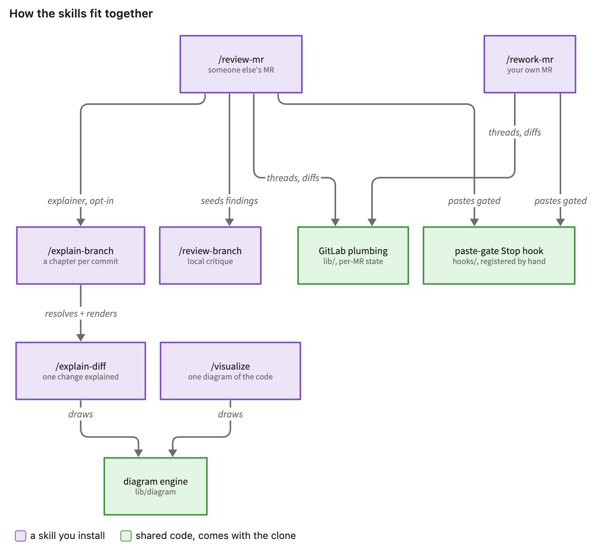

# agent-skills

[Claude Code](https://docs.claude.com/en/docs/claude-code) skills for **agentic code review** and
for understanding unfamiliar code. The agent does the reading, the digging and the drafting,
with a human in the loop for every judgement.

They cover three kinds of work:

- **Understand code and changes.** Turn a diff, a branch or a merge request into a page that
  teaches it, or draw one diagram that answers one question about the codebase.
- **Review someone else's code.** A prioritized critique of a local branch, or a full review of
  a GitLab merge request, taken comment by comment until every point is settled.
- **Act on review feedback.** Work through the threads on your own GitLab merge request one topic
  at a time: agree on the fix, make it, push it, answer the thread.

The merge-request skills work against GitLab, through the
[`glab`](https://gitlab.com/gitlab-org/cli) CLI — no other forge today. Nothing reaches it
unattended: they prepare the work and draft the words, while posting a comment, pushing a fix
and closing a thread each wait for a go-ahead.

The skills also build on each other, and the parts they share come with the clone:

<picture>
  <source media="(prefers-color-scheme: dark)" srcset="docs/skills-overview-dark.png">
  
</picture>

Drawn by `visualize` itself, from [`docs/skills-overview.json`](docs/skills-overview.json) —
which doubles as a worked example of a diagram spec.

---

## The skills

### Understanding a change

| skill | what it does |
|---|---|
| **explain-diff** | An interactive HTML page that teaches one code change — background, intuition, a code walkthrough, diagrams and a quiz — then opens it in the browser. Targets the current branch, a named local or remote branch, a GitLab MR, or just the last commit. |
| **explain-branch** | The same page for a whole branch or MR, structured as one chapter per substantial commit: the "how this feature was built, step by step" story, with an intro, a summary and per-chapter quizzes. Falls back to the flat `explain-diff` shape when there is only one commit, or too few substantial ones to earn chapters. |

Both pages are self-contained — their own styling, diagrams and quizzes — and follow the
reader's light/dark preference, with a toggle to override it. One can be sent to somebody who
has none of this installed.

### Drawing the codebase

| skill | what it does |
|---|---|
| **visualize** | One diagram that answers one question about the code — a database layout, a request or interaction flow, how a set of classes relate, a state machine, an architecture, or a before/after pair for a migration. It explores the code for the facts, renders with [D2](https://d2lang.com), then measures the finished drawing in a headless browser and holds it to objective checks: no unreadably small text, nothing hidden behind an annotation, nothing cut off, and WCAG AA contrast — a palette that clears it in light and dark alike. |

Diagrams inside an explainer come from the same engine and pass the same checks; the only
difference is that they also have to fit the article's column.

### Reviewing

| skill | what it does |
|---|---|
| **review-branch** | A critique-only review of every commit on the current branch since it diverged from the remote default branch (detached HEAD included). A flat, prioritized list of concrete flaws with fix hints — severity-tagged, `file:line`-anchored, no praise, no summary. Local only: no GitLab. |
| **review-mr** | Reviews a GitLab MR **someone else wrote**, end to end. It can generate an explainer first, seeds its findings from `review-branch`, then works through them with the reviewer one topic at a time and drafts a concise comment for each — in the language configured per repo, German by default — which the reviewer posts in the GitLab UI, so the tone stays human. A re-review loop keeps the MR alive over days: on every check it reconciles author replies, resolutions and new pushes, reports what was addressed, offers the per-topic diff, and closes nothing without an explicit ack. Read-only against GitLab, and all git work happens in a dedicated worktree, so the current checkout is untouched. |
| **rework-mr** | The mirror image: the reviewer feedback on an MR **you wrote**. It retrieves the open threads, keeps a per-MR plan so a multi-day cycle survives across sessions, and walks the threads one topic at a time — a straight recommendation for trivial points, a longer discussion for the rest. Per topic it drives the fix test-first, fixes it up into the commit it belongs to instead of piling new ones on top, force-pushes, and drafts the thread reply in the thread's own language. |

Neither merge-request skill needs an MCP server; `glab` alone is enough.

---

## Usage

Every skill is invoked by name, or just by asking for the thing it does.

```
/visualize show me the database layout
/visualize what happens when a user logs in

/explain-diff                 # the current branch
/explain-diff branch:feat/x   # a named local or remote branch
/explain-diff mr:123          # a GitLab MR, resolved via glab
/explain-diff commit:abc1234  # one commit
/explain-branch mr:123        # same targets, chapter-per-commit shape

/review-branch                # local critique of the current branch
/review-mr 123                # review someone else's MR, then re-review it over days
/rework-mr                    # work through the feedback on your own MR
```

`review-mr` and `rework-mr` are resumable: run them again later — a new session, a new day —
and they pick the MR's state back up rather than starting over.

---

## How they fit together

What the diagram at the top of this page means for installing:

- **`explain-branch` needs `explain-diff` installed.** It has no scripts of its own: it resolves
  its target and renders its page through `explain-diff`'s, and hands the whole job over to it
  when a range turns out to be a single commit.
- **`review-mr` needs `explain-branch` and `review-branch` installed** (and therefore
  `explain-diff` too). It runs the explainer in the background and `review-branch` in the
  foreground to seed its findings.
- **`visualize`, `review-branch` and `rework-mr` stand alone.**
- **Shared code needs nothing installed.** The diagram engine and the GitLab plumbing live in
  `lib/`, inside the clone every symlink points at, so they are always there — which is why the
  `explain-*` skills draw without `visualize`.

---

## Installation

Every skill lives in `skills/<name>/`, so linking them all is one loop. **Keep the clone where
you put it**: the links point back into it, and the scripts find their shared code relative to
the real file.

```bash
git clone git@github.com:yogan/agent-skills.git ~/src/agent-skills
for s in ~/src/agent-skills/skills/*/; do
  ln -sfn "${s%/}" ~/.claude/skills/"$(basename "$s")"
done
```

Or pick individual ones, keeping [How they fit together](#how-they-fit-together) in mind, since
some need a sibling installed as well:

```bash
ln -sfn ~/src/agent-skills/skills/visualize     ~/.claude/skills/visualize
ln -sfn ~/src/agent-skills/skills/explain-diff  ~/.claude/skills/explain-diff
```

Verify nothing dangles — a broken skill link fails silently, the skill just stops being
offered:

```bash
for d in ~/.claude/skills/*/; do
  [ -f "$d/SKILL.md" ] || echo "BROKEN: $d"
done
```

Restart Claude Code (or start a new session) afterwards, so it picks the new skills up.

### Required for `review-mr` and `rework-mr`: a `Stop` hook

Both skills work by showing things — an overview table, a quoted topic with its code, a drafted
comment, the diff behind a push. Claude Code collapses tool output, so the chat message is the
only window onto them, and a model told to paste a block verbatim will paraphrase it away
instead. A shared `Stop` hook closes that gap: it checks the finished turn for the output of
every gated command that ran, and blocks the turn until the block is really there. It **fails
open**, so a bug in it can never wedge a session, and it never fires outside those two skills.

**Installing it needs a manual edit to `~/.claude/settings.json`** — skills cannot register
their own hooks. One symlink and one `Stop` entry, both copy-pasteable:
[`hooks/README.md`](hooks/README.md).

### Recommended: three read permissions

Claude Code guards `~/.claude/**` separately from the normal permission rules — a blanket
`Read` allow does **not** cover it — so without these, every skill file and every per-MR state
file an agent opens raises a prompt, and the dialog's "don't ask again" only remembers it for
the one repo. Add them to `~/.claude/settings.json`:

```json
{
  "permissions": {
    "allow": [
      "Read(~/.claude/skills/**)",
      "Read(~/.claude/rework-mr/**)",
      "Read(~/.claude/review-mr/**)"
    ]
  }
}
```

The first covers the skills' own files, the other two the state both merge-request skills keep
per MR. The `~/` prefix is required: in *user* settings a bare `/path` resolves to
`~/.claude/path`, not to the filesystem root. `Read` is enough — every write goes through the
skills' own scripts.

---

## Requirements

| you need | for |
|---|---|
| `python3` | almost everything: the explainers, every diagram, both merge-request skills, and the `Stop` hook |
| [`glab`](https://gitlab.com/gitlab-org/cli), authenticated | `review-mr` and `rework-mr`, plus `mr:123` targets for the `explain-*` skills |
| [D2](https://d2lang.com) — `brew install d2` | every diagram, in `visualize` and the explainers alike |
| `node` + `puppeteer-core` — `npm i -g puppeteer-core` | measuring a diagram in a real browser: where an annotation fits, and whether anything is cut off |

`review-branch` needs none of them. Two things worth knowing about the diagram side:

- **Pin the D2 version.** The engine relies on a few behaviours D2 does not document, so it
  records the release it was measured against and says so when the installed one differs. An
  upgrade is a reason to re-check the diagrams, not a routine bump.
- **`puppeteer-core` drives a browser you already have** — Chrome, Chromium or Edge — rather
  than downloading a few hundred MB of its own. Point it elsewhere with
  `PUPPETEER_EXECUTABLE_PATH`, or install the full `puppeteer` if there is no system browser.
  Without any browser the diagrams still render and every other check still runs; the one that
  finds cut-off text then reports that it could not run, rather than passing.

On macOS, a drafted comment also lands on the clipboard, ready to paste.

---

## Under the hood

Just enough to find your way around; the working rules for changing any of it are in
[CLAUDE.md](CLAUDE.md).

| path | what it is |
|---|---|
| `skills/<name>/` | one skill each — `SKILL.md`, sometimes a `REFERENCE.md`, and its Python in `scripts/` |
| `lib/diagram/` | the diagram engine: a description in, a checked diagram out. Entry point, rules and change loop in [`lib/diagram/README.md`](lib/diagram/README.md) |
| `lib/` | Python shared repo-wide — GitLab access, per-MR state, code snippets |
| `hooks/` | the paste-enforcement `Stop` hook — [`hooks/README.md`](hooks/README.md) |
| `e2e/` | a local GitLab rig for exercising `review-mr` / `rework-mr` — [`e2e/README.md`](e2e/README.md) |
| `docs/` | the diagram at the top of this page, and the spec it is drawn from |

Tests are plain `unittest`, colocated as `test_<module>.py`. `python3 run_tests.py` runs the
fast suite; `--changed` runs only what the uncommitted edits can reach.

## License

MIT — see [LICENSE](LICENSE).
